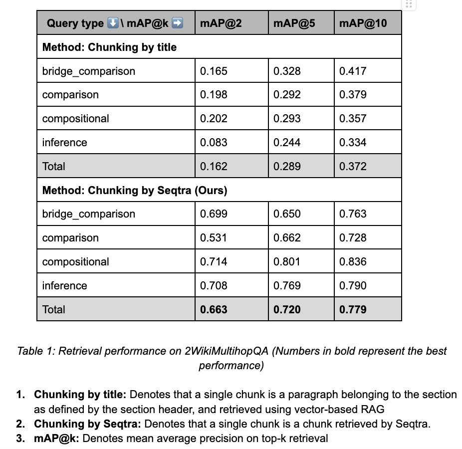

<br>
# SeqtraClient
Seqtra combines chunking and retrieving in one stage, i.e. chunking only with respect to the query during retrieval rather than defining chunk boundary during the ingestion phase. This strategy is known as late chunking in literature. Please note that we only accept PDFs for now.
## Setup
Python Version: Python 3.10.16<br>

Clone the repository:
```bash
    git clone https://github.com/seqtra/SeqtraClient.git
```
Create an environment and do:
```bash
    pip install -r requirements.txt
```


## Test on your own input
### Using UI
Run the following:
```python
    streamlit run client_ui.py
```
## Using Code
(The following description also applies to fields you see on UI)
In config/request.yaml file:
1. Change the value of api_token to provided Seqtra API token.
2. Change the value of project_name to create different file collection. Make sure to do this in order to not mix up your personal files with already existing test file or segregate the knowledge base according to data or application domain. This will also avoid unintentionally reducing the page limit available.
3. Replace the folder path in file_dir key with your folder path where the PDF files to be uploaded are stored. Please note that we have 100 total page (single or multiple PDFs) limit currently.
4. Replace the query in query key with your own query
5. You can skip steps 6 and 7 if you assign chunk_only to true.
6. Replace llm with preferred choice between "claude" and "openai"
7. Add your LLM API key to llm_key
8. Run "python client.py".
9. The results will be saved under results folder in the form of JSON.

The description of the rest of the parameters in request.yaml file are discussed below:
1. **chunk_only**: Setting this to false provides the answer to the query using LLM along with the retrieved chunks. Setting it to true provides you with only the relevant chunks.
2. **strategy**: We currently provide four strategies to chunk and retrieve relevant context for the given query:<br><br>
&emsp;a) **seed_only**: This is similar to conventional vector based retrieval, where it will only retrieve chunks which are relevant with respect to the given query but by definition, independent with each other. These will be labeled as chunk during the retrieval, but within the database, the actual categories of these chunks are text related class labels of [DocLayNet](https://arxiv.org/pdf/2206.01062) including "Text", "List-item" and so on.<br><br>
&emsp;b) **seed_extended**: In addition to a), it also retrieves additional context, i.e. other paragraphs and list items of the document section within which the given seed chunk is embedded in the document.<br><br>
&emsp;c) **graph**: Along with chunks in "seed_only", it also retrieves additional chunks which are related to the seed chunk, providing additional context. This relationship is established during the ingestion phase either through conceptual linkages, or hyperlink linkages internal to the document (for example, some text pointing to some other paragraph or section within the document).<br><br>
&emsp;d) **graph_extended**: This combines "graph" strategy with "seed_extended" strategy. This retrieves additional sibling texts of the seed chunk along with the graph linkages.<br>   
You may explore the strategy and adopt the most optimal one for your use case and nature of the document. For example, "graph" strategy might suffice for paragraph-heavy documents while legal documents with list-heavy clauses might require to use "graph_extended" strategy. So, c) and d) are our major offerings, a) and b) are provided as an additional options which you may find in other services also.

3. **num_seed_nodes**: This is equivalent to topk parameter in RAG. It is named so in our service, due to the presence of graph linkages and traversal during chunking and retrieval. You may optimize this for your use case.

## How to Interpret the output JSON
(These are visualized if you use the UI)
Keys:
1. **"chunks"**: JSON object in the format of ("chunk_i", "chunk_id") key value pairs, where i runs from 1 to n (number of chunks retrieved). "chunk_id" represents node id in the graph database.
2. **"answer"**: Answer to the given query based on retrieved chunks. It will be an empty string if "chunk_only" is set to true.
3. **"graph"**: JSON Object with "nodes" and "edges" keys. Each is a list of JSON objects each representing a graph node in "nodes" case, while a graph edge in "edges" case. This graph represents relationship among chunks in "chunks" key. if, for example, num_seed_node is set to 1, and you have used one of graph strategies, one of the chunks is the seed node, and additional nodes are retrieved due to their links to the seed node as extracted during the ingestion stage. "nodes" data also contains pdf name, page number and bounding box information to locate the exact section of the chunk in the pdf. Bounding box is in the format of (left, top, width, height).

You may further rerank and filter the retrieved chunks if it fits your use case.

## Delete project
To delete project use the following code:
```python
from omegaconf import OmegaConf

from src.seqtra_client import SeqtraClient
    
req_cfg = OmegaConf.load("./config/request.yaml")
SeqtraClient.remove(url=req_cfg.url, project_name=req_cfg.project_name, api_token=req_cfg.api_token)
```
## Benchmark
Here, we can observe that seqtra outperforms conventional vector-based retrieval. We also see that the jump between each top-k performance is lower in the case of seqtra. That means we demonstrate a better performance than top 10 retrieval of vector-based RAG with fewer seed node retrievals.
<br>
## Future Releases
1. Speed Improvements
2. Chunking improvements so that relevance of retrieved chunks is more tied to the query further optimizing the chunk size and number.
3. Incorporating VLM models to store both text and image data.